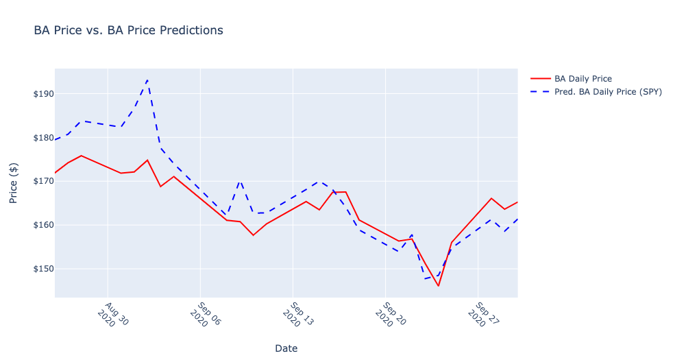
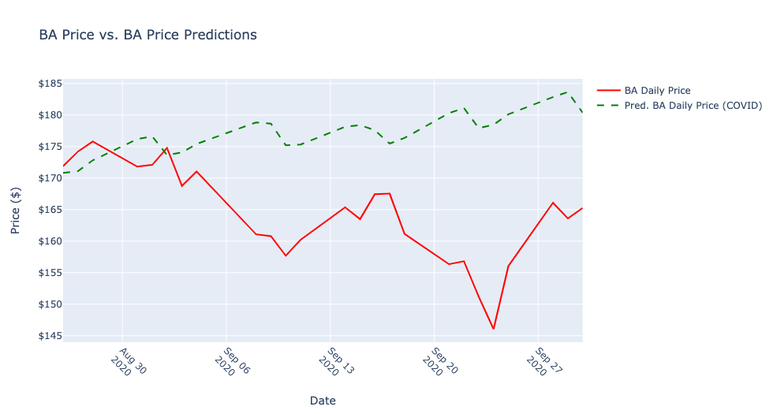
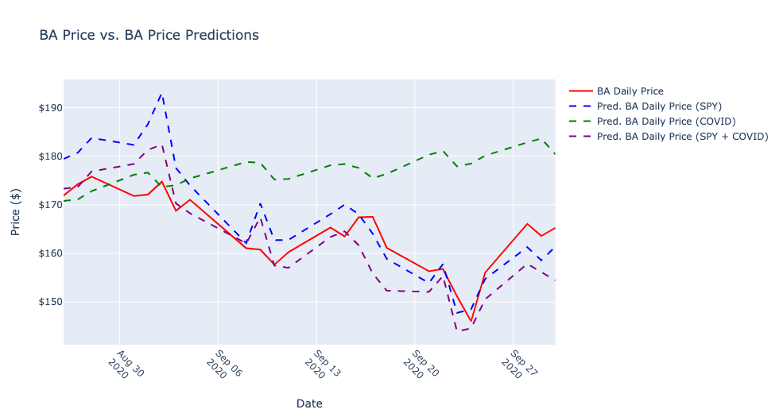

<h1 align="center">Auto ARIMA Time-Series Analysis: U.S COVID-19 Mortalities, and US Equities</h1>

## Abstraction

In a prior analysis, using an ordinary least squares regression, I created a model that explained 55.7% of the variation in Boeing (BA) common stock pricing using a 7-day rolling average for U.S COVID-19 mortalities. Additionally, I found this statistic had a correlation with the daily price of **-0.749**. 

Recently, I learned about time-series analysis and I wanted to revisit this data with new tools. 

I split the data into a train and test set, then I used an ARIMA (Auto Regressive Integrated Moving Average) model to and predict prices for the test set.

I created multiple models, one using the SPY (SPDR S&P ETF Trust) security as a benchmark to see if the 7-day rolling mortality statistic outperformed the SPY as a predictor or helped to improve the predictions.

I created the three models, used the models to predict the price for 25 days, took the difference in the predictions from the test data set, squared the differences, and added them for each model. The results were:

- Using just the **SPY index**, the sum of the difference between predicted and actual prices squared was **39.64275095954604**
- Using just the **COVID data**, the sum of the difference between predicted and actual prices squared was **80.52527950668268**
- Using **both the SPY and the COVID data**, the sum of the difference between predicted and actual prices squared was **16.425098154198338**

## Introduction

I wouldn't covet this as my most professional analysis. In a previous report, I found a correlation and created a model using an Ordinary Least Squares Regression that accounted for 55.7% of the variation of in BA price.

Knowing that there was a correlation, and the mortality statistic explained some of the variation, I pursued to find that same characteristic in a time-series analysis. Therefore, this was less of a purely scientific inquiry, and more of a way to practice building a model using a Python library with auto ARIMA capabilities.

I started out, looking for time-series components (auto regressive or moving average) in the daily BA price, but found little patterns in the time lags. It wasn't until I returned to the auto ARIMA function, including exogenous variables that the coefficients became significant.

After, finding significance in one lag and the two exogenous variables, I began building the three models.

## Methods

### Data Collection

**Historical stock data** was obtained from the Python library `yfinance` that offers:
"\[...\] a reliable, threaded, and Pythonic way to download historical market data from Yahoo! finance."

The historical stock data retrieved was for The Boeing Company (BA) and the S&P 500 ETF Trust (SPY) for the dates March 31, 2020-October 1, 2020. The adjusted closing price was extracted and used to represent the price for each equity. 

**COVID-19 data** was obtained from the Covid Tracking Project (https://covidtracking.com/data). How does CTP source their data?

> Almost all of the data we compile is taken directly from the websites of local or state/territory public health authorities. Where data is missing from these websites, we supplement available numbers with information from official press conferences with governors or public health authorities.

The full dataset was downloaded in CSV format, and exists in the repository in full. Only one column was selcted, **deathIncrease**. This data was reported by date and by state.

### Data Transformation and Preparation

The **deathIncrease** column was a daily aggregate from all the reporting states. To create a similar mortality statistic to the previous analysis, the **deathIncrease** column was replaced with a 7-day rolling avg. for mortality. This shrunk the total data set by 7 days starting the dataset on 4-8-2020.

*It may have been appropriate to convert the prices for the securities to a 7-day average. However, this step was not taken*

The total data set was split, allocating 80% (97 obs.) of the values to training set, and 20% (25 obs.) to the test set.

### Modeling

Each of the three models was created using an automated ARIMA function. Additionally, each model received the BA training set, and one or more exogenous variables. The potential orders for the model were capped as follows:

    max_p=7, # AR components
    max_q=7, # MA components
    max_d=2, # integrations allowed
    max_P=5, # seasonal
    max_Q=5, # seasonal
    max_D=2,  # seasonal
    max_iter=50, # some models fails to converge after 50 iterations so this argument can be increased

Significance was defined at a 5% level. The information criterion to judge a models fit was determined by the AIC (Akaike information criterion).

## Results

### SPY only exog variable results

#### SARIMAX Results                                

Log Likelihood                **-322.288**

AIC                            **654.571**

p-value for SPY exog variable: **~0.00**

p-value for one AR lag **~0.00**

After creating the model, I used the model to predict the next 25 days (specified by the test set from 8-26-2020 to 9-30-2020) passing the equivalent exogenous variables to the prediction method that were used to create the model.

Then, I graphed the predicted values alongside the actual price values from the test set.

Finally, I calculated the differences, squared them, and added up the total.



The sum of the squared differences totaled **39.64275095954604**

### COVID only exog variable results

#### SARIMAX Results                                

Log Likelihood                **-338.895**

AIC                            **687.789**

p-value for COVID exog variable: **~0.007**

p-value for one AR lag **~0.000**

After creating the model, I used the model to predict the next 25 days (specified by the test set from 8-26-2020 to 9-30-2020) passing the equivalent exogenous variables to the prediction method that were used to create the model.

Then, I graphed the predicted values alongside the actual price values from the test set.

Finally, I calculated the differences, squared them, and added up the total.



The sum of the squared differences totaled **80.52527950668268**

### COVID + SPY exog variable results

#### SARIMAX Results                                

Log Likelihood                **-321.033**

AIC                            **654.065**

p-value for SPY exog variable: **~0.000**
p-value for COVID exog variable: **~0.000**

p-value for one AR lag **~0.000**

After creating the model, I used the model to predict the next 25 days (specified by the test set from 8-26-2020 to 9-30-2020) passing the equivalent exogenous variables to the prediction method that were used to create the model.

Then, I graphed the predicted values alongside the actual price values from the test set.

Finally, I calculated the differences, squared them, and added up the total.



The sum of the squared differences totaled **16.425098154198338**

## Conclusion

After creating the models and analyzing the results, it's reasonable to conclude that for this time period, combining the two statistics (SPY and COVID mortality) proved to produce the best predictions.

However, the SPY index on it's own was, overall, a much better predictor than the 7-day mortality average.

Furthermore, it's often easy to improve predictions by simply including more data. Therefore, given the limited scope of the data used more analysis could certainly be done in testing the robustness of this predictor.


```python

```
